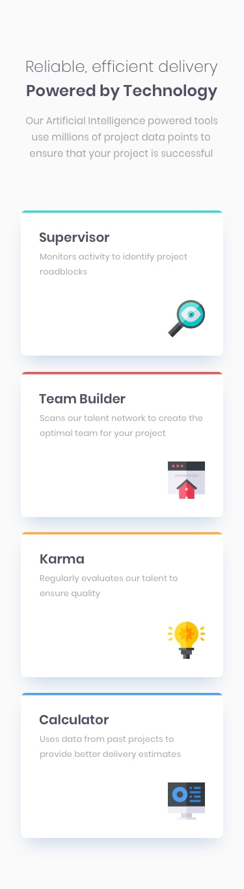

# Frontend Mentor - Four card feature section solution

## Welcome! 👋

This is a solution to the [Four card feature section challenge on Frontend Mentor](https://www.frontendmentor.io/challenges/four-card-feature-section-weK1eFYK). Frontend Mentor challenges help you improve your coding skills by building realistic projects.

## Table of contents

- [Overview](#overview)
    - [The challenge](#the-challenge)
    - [Built with](#built-with)
    - [Screenshot](#screenshot)

## Overview

### The challenge
- the challenge is to build out this feature section and get it looking as close to the design as possible.

Users should be able to:

- View the optimal layout for the site depending on their device's screen size

### Built with

- Semantic HTML5 markup
- CSS custom properties
- Flexbox
- CSS Grid

### Screenshot

